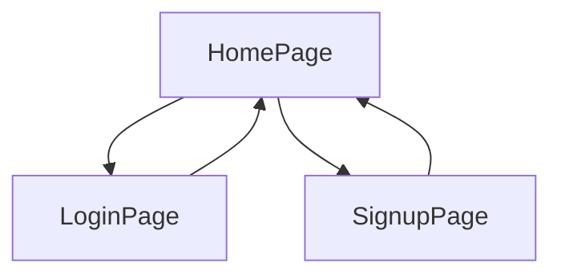

### What work you need to do to finish Sulaiman project

1. Get the minimal app working on hosted environmen and on phone if possible
2. Keep the timing that is by Friday on 13th
3. Keep all work under on main folder so that you do not need to open it from somewher else.
4. Keep the working project under this project too.
5. keep wirting the what yo uare doing in readme.md as you keep forgetting what you are doing. 
6. Do not waste time in building images, copy paste and provide the references to the originals.
7. Keep one format of your work do not follow what others have done than later on use the heading and arrange it so that it makes sense.
8. Get Sulaiman to uderstand what is happening on Sunday at least once, as he will be asked to demostrate as it appears to be the highest level of work of his capabilites.
9. Get the 

### Requirements for such a project

- Websites typically follow a client-server architecture, where the client refers to the user's web browser (such as Chrome, Firefox, or Safari), and the server refers to a remote computer that hosts the website's files and data. When a user visits a website, their browser sends a request to the server, asking for the website's content. These request uses HTTP verbs such as `GET` method for the page navigation.
- Similarly when a user submits a form on a webpage (such as a login form, registration form, or search form), the browser sends a request to the server to process the form data. This request can use either the HTTP GET or POST method, depending on the form's configuration and the type of data being submitted.
- Web pages often contain resources such as images, stylesheets, scripts, and fonts that are loaded asynchronously from the server. Each of these resources triggers a separate request to the server, allowing the browser to fetch and render them independently while the rest of the page loads.
- Modern web applications frequently interact with remote APIs (Application Programming Interfaces) to retrieve data, perform actions, or integrate with external services. These API requests can be initiated from the client side using various techniques, such as AJAX, the fetch API, or client-side libraries/frameworks.
- All the above usually refers to a term commonly known as `Client/Server` architecture.

- **Client-Side Activities**: Client-side activities refer to tasks and operations that are performed within the user's web browser. This includes rendering HTML, executing JavaScript code, and handling user interactions such as clicks and form submissions. Client-side activities are responsible for creating the user interface and providing interactivity to the user.
- **Server-Side Activities**: Server-side activities, on the other hand, are performed on the server, typically using server-side technologies like Node.js. These activities include processing user requests, executing business logic, interacting with databases, and generating dynamic content. Server-side activities are responsible for handling the backend operations of the application, such as user authentication, data validation, and database management.
- **Role of Node.js in Client-Server Communication**:Node.js plays a crucial role in facilitating communication between the client-side and server-side components of web applications. It serves as the backend infrastructure for handling client requests, processing data, and sending responses back to the client. By leveraging the power of Node.js, developers can build fast, scalable, and real-time web applications that deliver a seamless user experience across different devices and platforms.

#### Why Node.js?

- **JavaScript Everywhere**: With Node.js, developers can use JavaScript for both client-side and server-side development, enabling a consistent and unified codebase.
- **Event-Driven Architecture**: Node.js utilizes an event-driven, non-blocking I/O model, which allows for efficient handling of concurrent requests and real-time applications.
- **Vibrant Ecosystem**: Node.js has a large and active community, providing a wealth of libraries and tools to streamline development.
- **Scalability**: Node.js applications can easily scale to handle large numbers of concurrent connections, making it suitable for building robust and scalable web applications.

#### How a simple nodejs server is created?

- The following code creates  a simple nodejs server that is run locally for developing environment.

```js
// Import the 'http' module
const http = require('http');
// Define the hostname and port number
const hostname = '127.0.0.1';
const port = 3000;
// Create a server
const server = http.createServer((req, res) => {
  // Set the response status and headers
  res.statusCode = 200;
  res.setHeader('Content-Type', 'text/plain');
  // Send the response
  res.end('Hello, World!\n');
});
// Start the server and listen for incoming requests
server.listen(port, hostname, () => {
  console.log(`Server running at http://${hostname}:${port}/`);
});

```
- The above code does the followings:
    1. Require the built-in http module, which provides functionality for creating HTTP servers using `const http = require('http');`. Declaring some variables for the port and hostname and assigned them some values.
    2. Uses the `http.createServer()` method to create a server instance. Pass a callback function to handle incoming requests.
    3. Within the callback function, handle incoming HTTP requests. This involves reading request data, processing it, and sending back a response.
    4. Specify the port number on which the server should listen for incoming requests.
- Similarly the same can be done using a nodejs module called `express` since it provides number of functionalities to ease the job it is also known as express framework. Following code shows how the same job is done using express module.

```js 
// Import the Express framework
const express = require('express');
// Create an Express application
const app = express();
// Define a route handler for the root path
app.get('/', (req, res) => {
  // Send a response
  res.send('Hello, World!\n');
});
// Define the port number
const port = 3000;
// Start the server and listen for incoming requests
app.listen(port, () => {
  console.log(`Server running on port ${port}`);
});
```
- If we see the above code closely there is not much difference except that express module is used and GET request is handled by a route. This is not we intend to achieve from express but we want our code to be modular and properly structured. For this purpose we use an MVC ( modal view controller ) architecture. Where components of a websites are treated separately.

#### MVC ( MOdel-View-controller) architecture

- it is a design pattern commonly used in software development to organize code and separate concerns.

- **Model**: The model represents the data and business logic of the application. It encapsulates the application's data and defines how it can be manipulated.In a database-driven web application, models often interact with the database to perform CRUD (Create, Read, Update, Delete) operations.View:

- **View**: The view is responsible for presenting the user interface and displaying data to the user. It renders the model's data in a format suitable for presentation, such as HTML, XML, or JSON. Views are typically passive components that receive data from the controller and display it to the user. 

- **Controller**: The controller acts as an intermediary between the model and the view. It handles user input and updates the model accordingly. Controllers contain the application's business logic, process user requests, and determine which view to render in response.

#### Key Principles

1. Separation of Concerns: MVC separates the application logic into distinct components, making it easier to understand, maintain, and extend.
2. Modularity: Each component (model, view, controller) can be developed, tested, and modified independently, promoting code reusability and scalability.
3. Flexibility: MVC allows for flexible interaction between components, enabling developers to change one component without affecting others.
4. Scalability: The modular structure of MVC facilitates the development of large-scale applications by dividing them into manageable parts.

Overall, MVC architecture provides a robust foundation for building complex software systems by promoting separation of concerns, modularity, and flexibility. It remains a popular choice for developing web applications due to its clear structure and well-defined responsibilities for each component. For this reason I have decided to use this pattern and develop this project.

### Application design

- Since the project promises to provide the full functional website its design is structured in steps. At first we only design the site to provide us the working websites that includes a home page providing the option of `Login` and `Signup` facilities. Once this stage is passed, testing is done,we will continue to the next stage.
- The project also promises that such a project should be used on mobile devices, thus it would try to achieve this functionality using Progressive Web App technologies before going to the next stage.

#### Design: Part-A

- The first part is achieve this goal to make a website that simply provide the user to Login or Register them to the website.



### Implementation of the design Part-A

- In MVc architecture `views` represents the interface or the webpages that user can interact with. When users presses or clicks on these interfaces client initiates the request to navigate to a different page, this requests is handled by the MVC architecture using `routes`. Similarly what is to be done in response to the request can be handled by the `controller` components.
- Express frame work makes our job easy to keep all these components of the web developing environment by providing us separate folders to keep the work modular while working behind the scene providing the logic to interact with each other.
- 


### Starting the project

1. Vscode has already been installed and necessary extensions are activated.
2. Nodejs and npm has also been installed along with Git.
3. To upload the work on the remote site I have chosen GitHub platform, and account with the user name SulaimanSayyed21 is already created.
4. An empty remote repo with the same name is created to be linked with the local working machine.
3. Setting up express 

#### Setting up express nodejs framework

- Though the folder structured can be created manually but `express` provides a cli(command line interface) to ease the work.
- To use the express cli, it has been installed using `npm install -g express-generator`.
- Express allows us to use different templating engine for the html code, I have chosen `ejs` as my template engine.

#### Generating the application skeleton.

1. The command `express --view=ejs h446` creates a skeleton folder structure. The out put is shown below.

```
> express --view=ejs h446                                       pwsh  12:53:12 

   create : h446\
   create : h446\public\
   create : h446\public\javascripts\
   create : h446\public\images\
   create : h446\public\stylesheets\
   create : h446\public\stylesheets\style.css
   create : h446\routes\
   create : h446\routes\index.js
   create : h446\routes\users.js
   create : h446\views\
   create : h446\views\error.ejs
   create : h446\views\index.ejs
   create : h446\app.js
   create : h446\package.json
   create : h446\bin\
   create : h446\bin\www

   change directory:
     > cd h446

   install dependencies:
     > npm install

   run the app:
     > SET DEBUG=h446:* & npm start

```
- Following is the listing of this directory

```txt
        Directory: K:\projects\2024\express\h446


Mode                LastWriteTime         Length Name
----                -------------         ------ ----
d----        08/04/2024     12:53                  bin
d----        08/04/2024     12:53                  public
d----        08/04/2024     12:53                  routes
d----        08/04/2024     12:53                  views
-a---        08/04/2024     12:53           1074   app.js
-a---        08/04/2024     12:53            290   package.json
```
- The application project folder name is provided above as `h446`. the above command also sets the html templating engine to be `ejs`.
- git is initialised into the `h446` folder and contents are added and first commit is made.

```git
> git init .
> git aa 
> git cm "initial commit: express app generated using express cli setting templating engine as ejs"
```
> Note: in above command git aa and cm are git aliases set by me to ease the work, the details of these shortcuts  will be provided in the Appendix

- git log shows the out put of repo state 

```git
> git log
commit 50e4c936f0a8cb1783dd76e199da7e1ac346f487 (HEAD -> main)
Author: SulaimanSayyed21 <sullisayyed21@outlook.com>
Date:   Mon Apr 8 12:59:25 2024 +0100
```
- Link is established between local and remote repository using `git remote add origin https://github.com/SulaimanSayyed21/h446Alevel.git`.
- Setting a branch name `git branch -M main`.
- Pushing the local repo to remote using `git push -u origin main`.
- The out put is shown below.

```git
 > git push -u origin main
Enumerating objects: 15, done.
Counting objects: 100% (15/15), done.
Delta compression using up to 16 threads
Compressing objects: 100% (12/12), done.
Writing objects: 100% (15/15), 2.56 KiB | 523.00 KiB/s, done.
Total 15 (delta 1), reused 0 (delta 0), pack-reused 0
remote: Resolving deltas: 100% (1/1), done.
To github.com-SulaimanSayyed21:SulaimanSayyed21/h446Alevel.git
 * [new branch]      main -> main
branch 'main' set up to track 'origin/main'.
```


- express framework has created a project.json file which contents are shown below.

```json
{
  "name": "h446",
  "version": "0.0.0",
  "private": true,
  "scripts": {
    "start": "node ./bin/www"
  },
  "dependencies": {
    "cookie-parser": "~1.4.4",
    "debug": "~2.6.9",
    "ejs": "~2.6.1",
    "express": "~4.16.1",
    "http-errors": "~1.6.3",
    "morgan": "~1.9.1"
  }
}
```
- The above has set the name of the app along with other information. A script is provided to run the application. In dependencies folder it telss us that this project depends upon these libraries. They are not yet installed. The first step is to install them by using `npm install`.
- When this command is run, npm install all the libraries under `node_modules` folder. It is time to see if our skeleton app is working or not.
- Using `npm run start` the script is started at `port 3000`.
- Terminal output is shown below.

```txt
> npm run start
> h446@0.0.0 start
> node ./bin/www

GET / 200 88.382 ms - 207
GET /stylesheets/style.css 200 5.964 ms - 111
GET /sw.js 404 3.356 ms - 993
GET / 200 2.621 ms - 207
GET /stylesheets/style.css 200 2.111 ms - 111
GET /favicon.ico 404 2.472 ms - 993
```
- The server snapshot is shown below.


- The above information shows us that server is run from `./bin/www` directory amd dofferemt `Get` requests are made the last one status shows `404` means that there was no `favicon` found. As the project goes along details will be provided of what is happening.
- At this state we install another npm library called `nodemon` so that while we work the server is updated. The nodemon watches any live changes in the code and as the files are saved it updates the server wihtout letting us stop and restart the server.
- To do so we use `npm i nodemon`. It can be installed globally or locally in this project. I have installed it globally as it helps me in other project.
- Adding a script in `project.json` file using `"dev":"nodemon --ext js,ejs,json,css ./bin/www"` this line. It lets us start the script using `npm run dev` where the word `dev` represents our development environment while the script `nodemon --ext js,ejs,json,css` are instructions given to nodemon to watch the changes in these file.
- Staring the server using `npm run dev`, following is the output of this command.

> If you clone this repo you will need to install nodemon using `npm install nodemon` to get the script working.

```txt
>npm run dev
> h446@0.0.0 dev
> nodemon --ext js,ejs,json,css ./bin/www

[nodemon] 3.1.0
[nodemon] to restart at any time, enter `rs`
[nodemon] watching path(s): *.*
[nodemon] watching extensions: js,ejs,json,css
[nodemon] starting `node ./bin/www`
```
- Since we have added the node_modules and it is a git project we create a `.gitignore` file so that node_modules is not included in our project. It is a common practice as it includes thousand of libraries folders. When anyone else clone this repository, one has to only run `npm install` and all dependencies are installed and project can be run. Also adding `Readme.md` file.
- Readme.md is a markdown file which can be rendered on any browser, it frees you to write contents in html file using different elements as `<h1>` etc.
- A commit is made to save the state of the repository.


### Starting to work on our design.


---

### Adding service worker

- It needs to be added it is a javascript file, you need to create and register in your app.
- it is named `sw.js`, it runs separately and runs in the background if no internet, it uses fetch api and cache api.
- You need to add `manifest.json`, in express app it is created under public folder as this is equal to root folder.
- Create a `sw.js` on the same level as your home page, in express it is under public folder. Add the functionality to get it working offline by adding as imle line `navigator.serviceWorker.register('/sw.js')`

- I am using workbox-cdn for this purpose and it is working.

---

- So far Design part-A is achieved which was dealing with the User interface part. When user press the `submit` button a `POST` request is made from the client which raises different concerns as discussed below:
    1. How to handle the POST request, so far we have handle `GET` request. How the data is coming whether it has to be parsed or not. 
    2. Where to store the data that is coming with `POST` request.
    3. How to validate the data that is if another user is using the same name which is already stored in the database.
    4. How to deal with user password, what security measures are to be used to secure the data. What methods are available.

### Database Setup

- MongoDB is to be used with our nodejs express application. Mongodb server community edition is installed locally.
- To interact from mongoshell a mongoshell is installed to work with database locally. It is placed in ProgramFiles/mongoshell/directory. The path in system environment is set to bin directory where two files are present.
- A GUI clinet named mongodb compass tool is used to connect to the database locally and online.
- Creating a `connection.js` file to connect to mongodb databse you have created.
- In config file we need to link our schma file present in the mdol folder. or
- From our application file  which is our appljs, we are to use this connection, so we require this model in this file.
- In order to connect your application to moongose data base you first need to install moongose library or node module in your project using npm i m

### Adding user model

- To store the data coming with post request from login or register, a user schema is required.
- A file name `users.js` is created in a new folder called `model`.
- To make sure that the user name and the email are unique some kind of functionality is needed.
- There is a plugin name `mongoose-unique-validator` is present and can be used for this purpose.
- To add this a variable name `uniqueValidator` is declared and assigned to `require('mongoose-unique-validator');` which provides the reference to the plugin.
- This plugin has to be registered with our modal and it is done by using `UserSchema.plugin(uniqueValidator, {message: 'is already taken.'});`
- exercises

---

### 1. Setup a cluster 

### 2. Created new project on atlas named Verbal Reasning

> Fist thing to add is a cluster name, it is `usersName0`, it can not be changed.

- It allows an app service ( check it out )

1. Allowed from every where using `0.0.0.0/0`. Note in production environment it needs to be changed otherwise anyone can do the changes, you only allow your ip address.
2. To get a connectino string, you click on connect , here many options are shown, they are all different: So checkh them out they may give you different connection string. Since we are using our app to connect to atals, choose `Drivers(Node.js, go etc.)`. Here version are already selected, it also says that you need to install `npm i mongo db`. and than application this is where you connection string is shown. 
3. It is : `mongodb+srv://sulli:<password>@usersname0.r4rl0vd.mongodb.net/?retryWrites=true&w=majority&appName=usersName0`
4. I have already add a Database user account to be `sulli` with ` password shown below.
5. The above string doesnot poin to any particular data base. You need to add it before qurey ? so the whole string would be as shown below.
6. `mongodb+srv://sulli:<password>@usersname0.r4rl0vd.mongodb.net/vrusrs?retryWrites=true&w=majority&appName=usersName0`
   
   
7. Current IP Address (86.157.81.90/32) added! Visit Network Access to modify your settings.

> You first need to create project. Then add database and finally deploy it.


3. Project name: Verbal-Reasoning:
3. username: sulli 
4. password:`21March2004` , if password contains special charater they are url encoded and has to be managed on when dealing with it ( ? )
5. Database Role: Atlas admin
6. connection string: `mongodb+srv://sulli:<21March2004>@vr.hzncxzw.mongodb.net/?retryWrites=true&w=majority&appName=VR` 

> Note the above connection string ends with `VR` indicating the cluster I created before but have left it. Its name is changed `to be deleted` as it was mistakenly deployed.

7. connection string: `mongodb+srv://sulli:<password>@usersname0.r4rl0vd.mongodb.net/?retryWrites=true&w=majority&appName=usersName0`. 

> Note: this cluster end on `userName0` it is the correct string.

8. `mongodb+srv://sulli:<password>@vr.hzncxzw.mongodb.net/`. This has been changed to be `deleted`.

9.  Code provided for connecting:

```js

const { MongoClient, ServerApiVersion } = require('mongodb');
const uri = "mongodb+srv://sulli:<password>@vr.hzncxzw.mongodb.net/?retryWrites=true&w=majority&appName=VR";

// Create a MongoClient with a MongoClientOptions object to set the Stable API version
const client = new MongoClient(uri, {
  serverApi: {
    version: ServerApiVersion.v1,
    strict: true,
    deprecationErrors: true,
  }
});

async function run() {
  try {
    // Connect the client to the server	(optional starting in v4.7)
    await client.connect();
    // Send a ping to confirm a successful connection
    await client.db("admin").command({ ping: 1 });
    console.log("Pinged your deployment. You successfully connected to MongoDB!");
  } finally {
    // Ensures that the client will close when you finish/error
    await client.close();
  }
}
run().catch(console.dir);

```

### 3. Creating database 

1. I have created `vrusers` it has collection object named `credentials`. This is where you will add different fields, either programatically or manually.
2. When you want to see the data base you need to go to lefthand panel, select `Databse` , It will show you the name of the cluster where data base is present. Click on Browse collection to see your Database.


---
### Install pwa on the home


---
###


---

### Please refer these sources.

1. Getting started with [PWapp](https://www.youtube.com/watch?v=3FL-NhQyNq8&ab_channel=DeepaSubramanian)
2. NodeJs and [PWapp](https://www.youtube.com/watch?v=kNU-nOKrjG8&ab_channel=DeepaSubramanian)
3. Realtime webapp with [mongo DB](https://www.youtube.com/watch?v=YixtWTGUyFk&t=1829s&ab_channel=MongoDB)
4. Look at this [article](https://dev.to/saint_vandora/how-to-build-progressive-web-apps-pwas-with-nodejs-5blm) It tells us how to get the service worker registered in your nodejs app.
5. What is a [Workbox](https://web.dev/learn/pwa/workbox) look a this site. It tells us what is it and how to use it in different ways.
6. For landing page use `Photo by <a href="/photographer/nkutluata-60910">nkutluata</a> on <a href="/">Freeimages.com</a>`

---